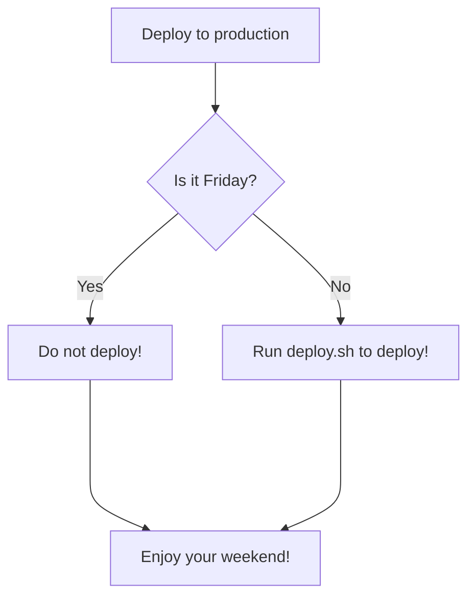
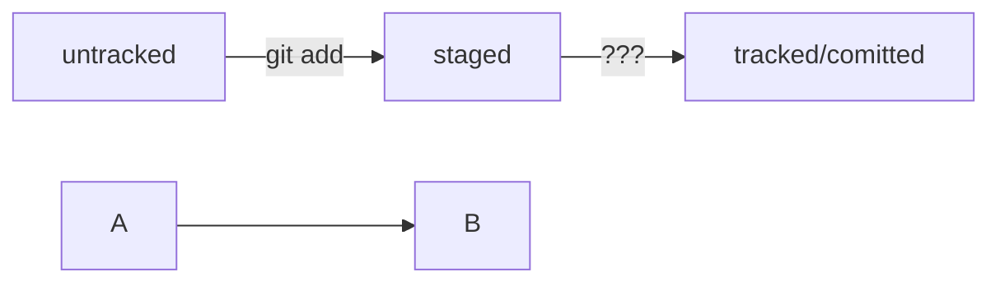

# Git_Cheat_Sheet

## Чтобы прекратить отслеживание файла, вам необходимо удалить его из индекса. Этого можно добиться с помощью этой команды.

`git rm --cached <file>`

## Если вы хотите удалить всю папку, вам необходимо рекурсивно удалить все файлы в ней.

`git rm -r --cached <folder>`

Удаление файла из основной ревизии произойдет при следующей фиксации.

## Отмена добавления файла `<file>` в индекс (staging area) с помощью команды 

`git restore --staged <file>`

Эта команда удаляет файл из индекса, но оставляет его в рабочей директории. 

## Если вы хотите отменить изменения в файле `<file>` и вернуть его к последней сохраненной версии, вы можете использовать команду 

`git checkout <file>`

## Если вы хотите вывести список всех файлов, отслеживаемых в данный момент в главном каталоге ветви `master/main`, вы можете использовать эту команду:

`git ls-tree -r main --name-only`

##  Если вам нужен список файлов, которые когда-либо существовали (т.е. Включая удаленные файлы):

`git log --pretty=format: --name-only --diff-filter=A | sort - | sed '/^$/d'`

# Навигация по коммитам

## Получить сокращённый лог `— git log --oneline`
Получить сокращённый лог можно с помощью команды `git log` с флагом `--oneline` (англ. «одной строкой»). 
В терминале появятся только первые несколько символов хеша каждого коммита и их комментарии.

`git log --oneline`

## Статусы `untracked/tracked`, `staged` и `modified`

- `untracked` (англ. «неотслеживаемый»)  
  Git «видит», что такой файл существует, но не следит за изменениями в нём. У untracked-файла нет предыдущих версий, зафиксированных в коммитах или через команду git add.
- `staged` (англ. «подготовленный»)  
  После выполнения команды `git add` файл попадает в staging area (от англ. stage — «сцена», «этап [процесса]» и area — «область»), то есть в список файлов, которые войдут в коммит. В этот момент файл находится в состоянии staged.
- `tracked` (англ. «отслеживаемый»)  
  Состояние tracked — это противоположность untracked. Оно довольно широкое по смыслу: в него попадают файлы, которые уже были зафиксированы с помощью git commit, а также файлы, которые были добавлены в staging area командой `git add`. То есть все файлы, в которых Git так или иначе отслеживает изменения.
- `modified` (англ. «изменённый»)  
  Состояние modified означает, что Git сравнил содержимое файла с последней сохранённой версией и нашёл отличия. Например, файл был закоммичен и после этого изменён.

## Команда `git status`:
- `git status` показывает явно следующие состояния файлов: `untracked`, `staged` и `modified`.
- `git status` подсказывает, какие команды можно выполнить, чтобы поменять состояние файла.

# Оформление сообщений к коммитам

в выводе команды `git log --oneline` умещается максимум **72** первых символа сообщения.

## Стили оформления

правила могут быть такие:

- длина сообщения от 30 до 72 символов;
- первое слово — глагол в инфинитиве («исправить», «дополнить», «добавить» и другие)

### Корпоративный

Во многих компаниях применяется `Jira` — система для организации проектов и задач. 
У каждой задачи в Jira есть идентификатор из нескольких заглавных латинских букв и номера. 
Например, LGS-239 значит, что это 239239-я задача в проекте LGS (сокращение от англ. logistics — «логистика»).
В корпоративном стиле в начале сообщения обычно указывают Jira-ID, а после — текст сообщения.

```BASH
$ git commit -m "LGS-239: Дополнить список пасхалок новыми числами"
```

### Стандарт **Conventional Commits** (англ. «соглашение о коммитах»)  

Формат коммита: `<type>: <сообщение>`.   
Первая часть `type` — это тип изменений. Таких типов достаточно много. Вот два примера:

- `feat` (сокращение от англ. feature) — для новой функциональности;
- `fix` (от англ. «исправить», «устранить») — для исправленных ошибок.

Более подробный список можно увидеть на [сайте с описанием этого стиля](https://www.conventionalcommits.org/ru/v1.0.0-beta.4/#%D1%81%D0%BF%D0%B5%D1%86%D0%B8%D1%84%D0%B8%D0%BA%D0%B0%D1%86%D0%B8%D1%8F).
Например, сообщение может быть таким.

```BASH
git commit -m "feat: добавить подсчёт суммы заказов за неделю"
```

### GitHub-стиль
GitHub можно использовать не только для хранения файлов проекта, но и для ведения списка задач (англ. issue) этого проекта.  
Если коммит «закрывает» или «решает» какую-то задачу, то в его сообщении удобно указывать ссылку на неё.   
Для этого в любом месте сообщения нужно указать `#<номер задачи>`. 

```BASH
$ git commit -m "Исправить #334, добавить график температуры" 
```
В таком случае GitHub свяжет коммит и задачу.    

#### Инфинитив и императив
Для сообщений на **русском языке** часто рекомендуют использовать инфинитивы. 

Например: `Добавить тесты для PipkaService`, `Исправить ошибку #123` и так далее.

Для сообщений на **английском** рекомендуется использовать повелительное наклонение (англ. imperative). 

Например: `Use library mega_lib_300`, `Fix exit button` и так далее.

***
# [Mermaid](https://github.blog/2022-02-14-include-diagrams-markdown-files-mermaid/)

## формат описания схем [Mermaid](https://github.blog/2022-02-14-include-diagrams-markdown-files-mermaid/). 

Принцип такой: вы описываете схему в специальном текстовом формате, а GitHub превращает описание в полноценную схему с блоками и стрелками.

Чтобы получить `mermaid-схему` в `README.md`, нужно добавить блок кода типа `mermaid`.




- Блоки кода в маркдауне начинаются и заканчиваются тремя символами \`\`\`. После первых трёх \`\`\` можно указать, какой именно код будет внутри блока. Например: \`\`\`mermaid , \`\`\`bash, \`\`\`python, \`\`\`javascript и так далее. Если ничего не указать, GitHub будет считать весь код простым текстом.

- Два символа %% обозначают в mermaid строку-комментарий.
- Чтобы сделать схему, нужно указать формат: `graph LR`. Graph — это простейший тип схем; для шпаргалки его будет достаточно.
- Чтобы добавить элементы и связи (стрелки), используют строки вида A --> B. Такая строка создаст квадратные блоки А и B и соединит их стрелкой.

Дополнительно можно указывать текст на стрелке. Например, так: `A -- "text" --> B`.



***
# Работа над ошибками в коммитах

## Как исправить коммит

`commit: git commit --amend`

> `--amend` работает только с последним коммитом (`HEAD`). Для исправления более ранних коммитов есть другие команды.

## Дополнить коммит новыми файлами — 
`git commit --amend --no-edit`

Дополните последний коммит забытым файлом `common.css` с помощью опции `--amend`.

```BASH
$ git add common.css
# добавили файл common.css в список на коммит как обычно

# но вместо команды commit -m '...'
# будет:
$ git commit --amend --no-edit

$ git log --oneline
8340eb2 Добавить главную страницу
# коммит в истории всё ещё один (но у него новый хеш)
```

> С опцией `--amend` команда commit не создаст новый коммит, а дополнит последний, просто добавив в него файл common.css. При этом хеш последнего коммита изменится, потому что изменился список файлов в коммите.
> опция `--no-edit` сообщает команде commit, что сообщение коммита нужно оставить как было.
> 
```BASH
# ещё раз отредактировали main.html

$ git add main.html # добавили в список на коммит
$ git commit --amend --no-edit
 ```
> Например, если вы случайно добавили неправильный файл в коммит, то вы можете использовать команду `it reset` чтобы отменить этот коммит. Если же ошибка была в самом содержимом коммита, то можно использовать `git commit --amend`, чтобы изменить или заменить его.

## Изменить сообщение коммита 

`git commit --amend -m "Новое сообщение"`

> Допустим, хочется заменить сообщение Добавить главную страницу на Добавить главную страницу и стили. Сделать это можно через `commit --amend` с флагом -m
```BASH
$ git commit --amend -m "Добавить главную страницу и стили"
$ git log --oneline
a31fa24 Добавить главную страницу и стили
```
> Хеш коммита снова поменялся, потому что изменились сообщение и время коммита. При этом файлы в коммите остались те же: `main.html` и common.css

## Случилось страшное: открылся редактор)))

> Если забыть указать у команды git commit --amend один из флагов (`--no-edit` или -m), Git предложит отредактировать сообщение коммита вручную. Для этого он откроет текстовый редактор, который установлен в системе по умолчанию. Чаще всего это либо GNU nano, либо Vim.

### nano — простой и свободный
1. Первая строка Добавить главную страницу и стили — это текущее сообщение коммита. Если вы хотите изменить сообщение, нужно отредактировать эту строку.
Допустим, решили добавить в конце сообщения восклицательный знак. Чтобы сохранить новое сообщение, нужно нажать `Ctrl+X`, где X значит exit (англ. «выход»).
2. В надписях вида ^X, ^G и других «шляпка» ^ обозначает кнопку Ctrl. То есть ^X — это то же самое, что и Ctrl+X.
3. После нажатия Ctrl+X nano предложит сохранить файл, для этого нужно нажать Y (от англ. yes).
4. Затем редактор предложит изменить имя файла, но делать этого не нужно — просто нажмите Enter
5. После нажатия Enter редактор закроется, а Git изменит сообщение последнего коммита.

> Если вы не хотите менять сообщение через редактор, можно выйти из него с помощью Ctrl+X, а затем выбрать N (от англ. no). В таком случае редактор закроется, и Git оставит сообщение последнего коммита «как было».

### Vim — великий и ужасный)))

Вот как выйти из Vim:

1. Нажмите клавишу `Esc`.
2. Наберите последовательность символов :qa!.
3. Нажмите Enter.

- Как добавить новый файл в последний коммит?  
  Убедиться, что файл в `staged` (`git add <file>`), и выполнить `git commit --amend --no-edit`
- Как изменить сообщение последнего коммита?  
  `git commit --amend -m "новое сообщение"`
***
- `--amend` рассчитан на работу с последним коммитом (HEAD).
- Дополнить коммит новыми файлами можно с помощью `git commit --amend --no-edit`. Благодаря опции `--no-edit` сообщение к коммиту останется таким, каким и было.
- Изменить сообщение к коммиту позволяет команда `git commit --amend -m "Обновлённое сообщение коммита"`.
***

# Как откатиться назад, если «всё сломалось»

## Выполнить unstage изменений — `git restore --staged <file>`

```BASH
$ touch example.txt # создали ненужный файл
$ git add example.txt # добавили его в staged

$ git status # проверили статус
Changes to be committed:
  (use "git restore --staged <file>..." to unstage)
        new file:   example.txt

$ git restore --staged example.txt
$ git status # проверили статус

Untracked files:
  (use "git add <file>..." to include in what will be committed)
        example.txt

no changes added to commit (use "git add" and/or "git commit -a")
# файл example.txt из staged вернулся обратно в untracked
```

> Вызов `git restore --staged example.txt` перевёл `example.txt` из staged обратно в `untracked`.  
Чтобы «сбросить» все файлы из staged обратно в `untracked/modified`, можно воспользоваться командой `git restore --staged .`: она сбросит всю текущую папку (`.`).

***
## «Откатить» коммит — `git reset --hard <commit hash>`
> (от англ. reset  — «сброс», «обнуление» и hard — «суровый»).

```BASH
$ git log --oneline # хеш можно найти в истории
7b972f5 (HEAD -> master) style: добавить комментарии, расставить отступы
b576d89 feat: добавить массив Expenses и цикл для добавления трат # вот сюда и вернёмся
4b58962 refactor: разделить analyzeExpenses() на countSum() и saveExpenses()

$ git reset --hard b576d89
# теперь мы на этом коммите
HEAD is now at b576d89 feat: добавить массив Expenses и цикл для добавления трат
```
> Теперь коммит b576d89 стал последним: вся дальнейшая разработка будет вестись от него. Файл также вернулся к тому состоянию, в котором был в момент этого коммита. А коммит 7b972f5 Git просто удалил. Это можно проверить, снова запросив лог. Он покажет следующее.

```BASH
$ git log --oneline
b576d89 (HEAD -> master) feat: добавить массив Expenses и цикл для добавления трат
4b58962 refactor: разделить analyzeExpenses() на countSum() и saveExpenses() 

Вот так схематично выглядит весь процесс «отката» с помощью git reset --hard <hash>.
Будьте осторожны с командой git reset --hard! При удалении коммитов можно потерять что-то нужное.
«Откатить» изменения, которые не попали ни в staging, ни в коммит, — git restore <file>
Может быть так, что вы случайно изменили файл, который не планировали. Теперь он отображается в Changes not staged for commit (modified). Чтобы вернуть всё «как было», можно выполнить команду git restore <file>.

# случайно изменили файл example.txt
$ git status
On branch main
Changes not staged for commit:
  (use "git add <file>..." to update what will be committed)
  (use "git restore <file>..." to discard changes in working directory)
          modified:   example.txt

$ git restore example.txt
$ git status
On branch main
nothing to commit, working tree clean
```

Изменения в файле «откатятся» до последней версии, которая была сохранена через `git commit` или `git add`.


## «Откатить» изменения, которые не попали ни в `staging`, ни в коммит, — `git restore <file>`

> Может быть так, что вы случайно изменили файл, который не планировали. Теперь он отображается в `Changes not staged for commit` (`modified`). Чтобы вернуть всё «как было», можно выполнить команду `git restore <file>`.

```BASH
# случайно изменили файл example.txt
$ git status
On branch main
Changes not staged for commit:
  (use "git add <file>..." to update what will be committed)
  (use "git restore <file>..." to discard changes in working directory)
          modified:   example.txt

$ git restore example.txt
$ git status
On branch main
nothing to commit, working tree clean
```

> Изменения в файле «откатятся» до последней версии, которая была сохранена через `git commit` или `git add`.

- Вы сделали коммит, после которого «всё сломалось». Какую команду использовать, чтобы «откатить» репозиторий на более ранний коммит?
	`git reset --hard <более ранний коммит>`
- Вы добавили изменения в staging area и хотите вернуть их в modified. Какую команду выбрать?
  	`git restore --staged <файл>`
- Вы случайно изменили файл, который вообще не хотели менять. Но в staging его пока не добавили. Какую команду нужно выполнить?
  	`git restore <файл>`

### Итог

- Команда `git restore --staged <file>` переведёт файл из staged обратно в modified или untracked.
- Команда `git reset --hard <commit hash>` «откатит» историю до коммита с хешем `<hash>`. Более поздние коммиты потеряются!
- Команда `git restore <file>` «откатит» изменения в файле до последней сохранённой (в коммите или в staging) версии.
***
