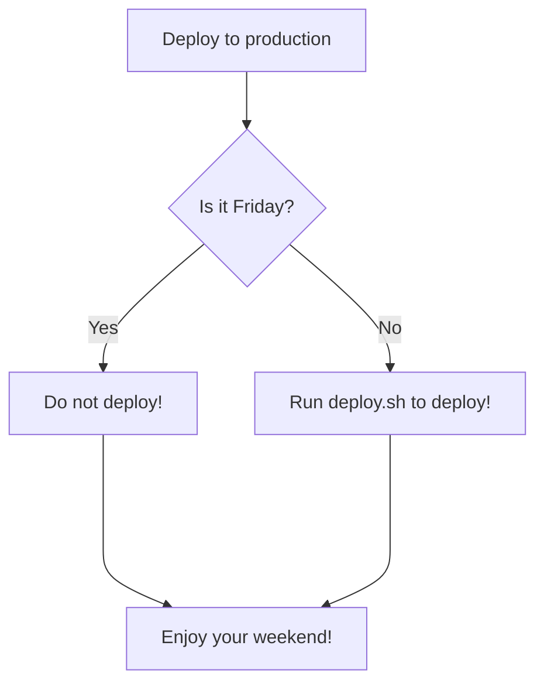
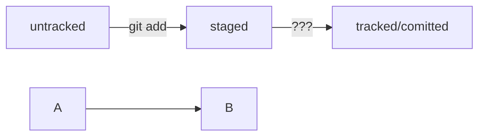

# Git_Cheat_Sheet

## Чтобы прекратить отслеживание файла, вам необходимо удалить его из индекса. Этого можно добиться с помощью этой команды.

`git rm --cached <file>`

## Если вы хотите удалить всю папку, вам необходимо рекурсивно удалить все файлы в ней.

`git rm -r --cached <folder>`

Удаление файла из основной ревизии произойдет при следующей фиксации.

## Отмена добавления файла `<file>` в индекс (staging area) с помощью команды 

`git restore --staged <file>`

Эта команда удаляет файл из индекса, но оставляет его в рабочей директории. 

## Если вы хотите отменить изменения в файле `<file>` и вернуть его к последней сохраненной версии, вы можете использовать команду 

`git checkout <file>`

## Если вы хотите вывести список всех файлов, отслеживаемых в данный момент в главном каталоге ветви `master/main`, вы можете использовать эту команду:

`git ls-tree -r main --name-only`

##  Если вам нужен список файлов, которые когда-либо существовали (т.е. Включая удаленные файлы):

`git log --pretty=format: --name-only --diff-filter=A | sort - | sed '/^$/d'`

# Навигация по коммитам

## Получить сокращённый лог `— git log --oneline`
Получить сокращённый лог можно с помощью команды `git log` с флагом `--oneline` (англ. «одной строкой»). 
В терминале появятся только первые несколько символов хеша каждого коммита и их комментарии.

`git log --oneline`

## Статусы `untracked/tracked`, `staged` и `modified`

- `untracked` (англ. «неотслеживаемый»)  
  Git «видит», что такой файл существует, но не следит за изменениями в нём. У untracked-файла нет предыдущих версий, зафиксированных в коммитах или через команду git add.
- `staged` (англ. «подготовленный»)  
  После выполнения команды git add файл попадает в staging area (от англ. stage — «сцена», «этап [процесса]» и area — «область»), то есть в список файлов, которые войдут в коммит. В этот момент файл находится в состоянии staged.
- `tracked` (англ. «отслеживаемый»)  
  Состояние tracked — это противоположность untracked. Оно довольно широкое по смыслу: в него попадают файлы, которые уже были зафиксированы с помощью git commit, а также файлы, которые были добавлены в staging area командой git add. То есть все файлы, в которых Git так или иначе отслеживает изменения.
- `modified` (англ. «изменённый»)  
  Состояние modified означает, что Git сравнил содержимое файла с последней сохранённой версией и нашёл отличия. Например, файл был закоммичен и после этого изменён.

## Команда `git status`:
- `git status` показывает явно следующие состояния файлов: `untracked`, `staged` и `modified`.
- `git status` подсказывает, какие команды можно выполнить, чтобы поменять состояние файла.

# Оформление сообщений к коммитам

в выводе команды `git log --oneline` умещается максимум **72** первых символа сообщения.

## Стили оформления

правила могут быть такие:

- длина сообщения от 3030 до 7272 символов;
- первое слово — глагол в инфинитиве («исправить», «дополнить», «добавить» и другие)

### Корпоративный

Во многих компаниях применяется Jira — система для организации проектов и задач. 
У каждой задачи в Jira есть идентификатор из нескольких заглавных латинских букв и номера. 
Например, LGS-239 значит, что это 239239-я задача в проекте LGS (сокращение от англ. logistics — «логистика»).
В корпоративном стиле в начале сообщения обычно указывают Jira-ID, а после — текст сообщения.

```BASH
$ git commit -m "LGS-239: Дополнить список пасхалок новыми числами"
```

### Стандарт **Conventional Commits** (англ. «соглашение о коммитах»)  

Формат коммита: `<type>: <сообщение>`.   
Первая часть `type` — это тип изменений. Таких типов достаточно много. Вот два примера:

- `feat` (сокращение от англ. feature) — для новой функциональности;
- `fix` (от англ. «исправить», «устранить») — для исправленных ошибок.

Более подробный список можно увидеть на [сайте с описанием этого стиля](https://www.conventionalcommits.org/ru/v1.0.0-beta.4/#%D1%81%D0%BF%D0%B5%D1%86%D0%B8%D1%84%D0%B8%D0%BA%D0%B0%D1%86%D0%B8%D1%8F).
Например, сообщение может быть таким.

```BASH
git commit -m "feat: добавить подсчёт суммы заказов за неделю"
```
### GitHub-стиль
GitHub можно использовать не только для хранения файлов проекта, но и для ведения списка задач (англ. issue) этого проекта.  
Если коммит «закрывает» или «решает» какую-то задачу, то в его сообщении удобно указывать ссылку на неё.   
Для этого в любом месте сообщения нужно указать `#<номер задачи>`. 

```BASH
$ git commit -m "Исправить #334, добавить график температуры" 
```
В таком случае GitHub свяжет коммит и задачу.    

#### Инфинитив и императив
Для сообщений на **русском языке** часто рекомендуют использовать инфинитивы. 

Например: `Добавить тесты для PipkaService`, `Исправить ошибку #123` и так далее.

Для сообщений на **английском** рекомендуется использовать повелительное наклонение (англ. imperative). 

Например: `Use library mega_lib_300`, `Fix exit button` и так далее.

# [Mermaid](https://github.blog/2022-02-14-include-diagrams-markdown-files-mermaid/)

## формат описания схем [Mermaid](https://github.blog/2022-02-14-include-diagrams-markdown-files-mermaid/). 

Принцип такой: вы описываете схему в специальном текстовом формате, а GitHub превращает описание в полноценную схему с блоками и стрелками.

Чтобы получить `mermaid-схему` в `README.md`, нужно добавить блок кода типа `mermaid`.




- Блоки кода в маркдауне начинаются и заканчиваются тремя символами \`\`\`. После первых трёх \`\`\` можно указать, какой именно код будет внутри блока. Например: \`\`\`mermaid , \`\`\`bash, \`\`\`python, \`\`\`javascript и так далее. Если ничего не указать, GitHub будет считать весь код простым текстом.

- Два символа %% обозначают в mermaid строку-комментарий.
- Чтобы сделать схему, нужно указать формат: graph LR. Graph — это простейший тип схем; для шпаргалки его будет достаточно.
- Чтобы добавить элементы и связи (стрелки), используют строки вида A --> B. Такая строка создаст квадратные блоки А и B и соединит их стрелкой.

Дополнительно можно указывать текст на стрелке. Например, так: `A -- "text" --> B`.



